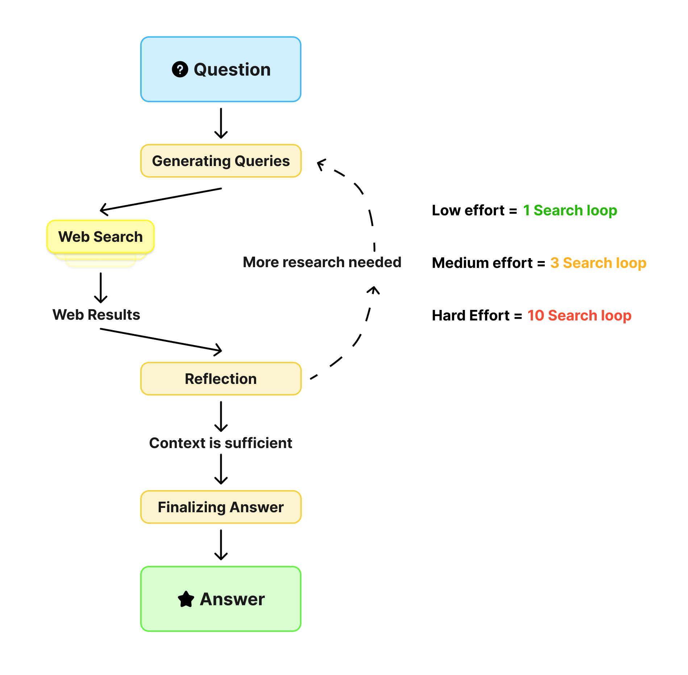

# DeepSearch V2 - Advanced AI Research Assistant


DeepSearch V2 is a sophisticated fullstack application that combines a modern Nextts frontend with a powerful LangGraph-powered backend agent. The system is designed to perform comprehensive research on user queries by dynamically generating search terms, querying the web using Google Search, reflecting on results to identify knowledge gaps, and iteratively refining searches until it can provide well-supported answers with proper citations.

## 🚀 Features

- **🧠 Advanced AI Research**: Powered by Google Gemini models for intelligent query generation and analysis
- **🔍 Dynamic Web Research**: Uses Google Search API for real-time web information gathering
- **🤔 Reflective Reasoning**: Identifies knowledge gaps and iteratively refines search strategies
- **📄 Citation-Rich Answers**: Generates comprehensive answers with proper source citations
- **⚡ Real-time Activity Tracking**: Live visualization of research progress and activities
- **🎨 Modern UI**: Beautiful, responsive interface built with Next.js 15 and Tailwind CSS
- **⚙️ Configurable Search Depth**: Adjustable research effort levels (Low, Medium, High)
- **🔄 Hot-reloading**: Seamless development experience for both frontend and backend

## 🏗️ Project Structure

```
deepsearch V2/
├── frontend/                 # Next.js 15 React application
│   ├── app/                 # Next.js app directory
│   ├── components/          # Reusable UI components
│   │   ├── ui/             # Shadcn UI components
│   │   ├── gsap/           # GSAP animation components
│   │   └── micro/          # Micro components
│   ├── sections/           # Page sections
│   │   └── chat/          # Chat interface
│   ├── context/           # React context providers
│   └── lib/               # Utility functions
├── backend/               # LangGraph Python backend
│   ├── src/agent/         # Core agent implementation
│   │   ├── graph.py       # LangGraph workflow definition
│   │   ├── prompts.py     # AI prompts and instructions
│   │   ├── state.py       # State management
│   │   └── utils.py       # Utility functions
│   └── examples/          # CLI usage examples
└── How.jpg               # Application workflow diagram
```

## 🛠️ Technologies Used

### Frontend

- **Next.js 15** - React framework with App Router
- **React 19** - Latest React with concurrent features
- **TypeScript** - Type-safe development
- **Tailwind CSS** - Utility-first CSS framework
- **Shadcn UI** - Beautiful, accessible component library
- **GSAP** - Professional-grade animations
- **LangGraph SDK** - Real-time streaming from backend

### Backend

- **LangGraph** - Multi-agent workflow orchestration
- **Google Gemini** - Advanced language models
- **Google Search API** - Web search capabilities
- **FastAPI** - High-performance API framework
- **Python 3.11+** - Modern Python with type hints

## 🚀 Getting Started

### Prerequisites

- **Node.js 18+** and npm/yarn/pnpm
- **Python 3.11+**
- **Google Gemini API Key** - Get one from [Google AI Studio](https://makersuite.google.com/app/apikey)

### 1. Environment Setup

Navigate to the backend directory and set up your environment:

```bash
cd backend
```

Create a `.env` file in the backend directory:

```bash
# Copy the example file
cp .env.example .env

# Edit the .env file and add your API key
GEMINI_API_KEY="your_actual_gemini_api_key_here"
```

### 2. Install Dependencies

**Backend Dependencies:**

```bash
cd backend
pip install .
```

**Frontend Dependencies:**

```bash
cd frontend
npm install
```

### 3. Run Development Servers

**Run Separately**

Backend:

```bash
cd backend
langgraph dev
```

The backend will be available at `http://localhost:2024`

Frontend:

```bash
cd frontend
npm run dev
```

The frontend will be available at `http://localhost:3000`

## 🧠 How the AI Agent Works



The DeepSearch agent follows a sophisticated multi-step research process:

### 1. **Query Generation**

- Analyzes your question using Gemini 2.0 Flash
- Generates multiple targeted search queries
- Optimizes queries for comprehensive coverage

### 2. **Web Research**

- Executes parallel web searches using Google Search API
- Gathers real-time information from multiple sources
- Tracks and catalogs all sources for citation

### 3. **Reflection & Analysis**

- Uses Gemini 2.5 Flash to analyze search results
- Identifies knowledge gaps and missing information
- Determines if additional research is needed

### 4. **Iterative Refinement**

- Generates follow-up queries for identified gaps
- Continues research until sufficient information is gathered
- Respects configurable research depth limits

### 5. **Answer Synthesis**

- Uses Gemini 2.5 Pro to synthesize final answer
- Incorporates all gathered information with proper citations
- Provides comprehensive, well-supported responses

## ⚙️ Configuration Options

### Search Effort Levels

- **Low**: Quick search (1 query, 1 loop) - Fast results for simple questions
- **Medium**: Balanced search (3 queries, 3 loops) - Good balance of speed and depth
- **High**: Comprehensive search (5 queries, 10 loops) - Deep research for complex topics

### AI Models

- **Gemini 2.5 Flash**: Fast, efficient reasoning for query generation and reflection

## 🖥️ User Interface

The application features a modern, intuitive interface:

- **Welcome Screen**: Get started with suggested queries
- **Real-time Activity Timeline**: Watch the AI research process in action
- **Chat Interface**: Natural conversation with the AI agent
- **Settings Panel**: Configure search depth and AI models
- **Theme Support**: Light and dark mode options
- **Responsive Design**: Works seamlessly on desktop and mobile

## 🔧 CLI Usage

For quick one-off research questions, you can use the CLI:

```bash
cd backend
python examples/cli_research.py "What are the latest trends in renewable energy?"
```

## 🚀 Deployment

### Production Build

1. **Build the Frontend:**

```bash
cd frontend
npm run build
```

2. **Deploy Backend:**
   The backend requires Redis and PostgreSQL for production. See the [LangGraph Documentation](https://langchain-ai.github.io/langgraph/) for deployment details.

### Docker Deployment

```bash
# Build the Docker image
docker build -t deepsearch-v2 -f Dockerfile .

# Run with docker-compose
GEMINI_API_KEY=<your_key> docker-compose up
```

## 📊 Performance Features

- **Parallel Processing**: Multiple search queries executed simultaneously
- **Streaming Responses**: Real-time updates during research process
- **Efficient Caching**: Optimized for repeated queries
- **Token Optimization**: Smart URL shortening to reduce API costs

## 🔒 Security & Privacy

- **API Key Security**: Environment-based configuration
- **No Data Persistence**: Queries and results are not stored
- **Secure Communication**: HTTPS for all API communications

## 🤝 Contributing

1. Fork the repository
2. Create a feature branch
3. Make your changes
4. Add tests if applicable
5. Submit a pull request

## 🙏 Acknowledgments

- Built with [LangGraph](https://langchain-ai.github.io/langgraph/) for agent orchestration
- Powered by [Google Gemini](https://ai.google.dev/) for advanced AI capabilities
- UI components from [Shadcn UI](https://ui.shadcn.com/)
- Animations powered by [GSAP](https://greensock.com/gsap/)
